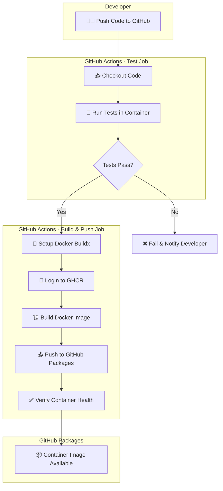
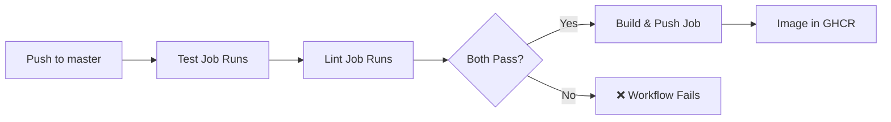
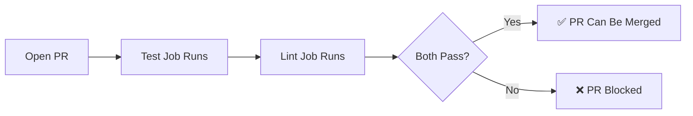
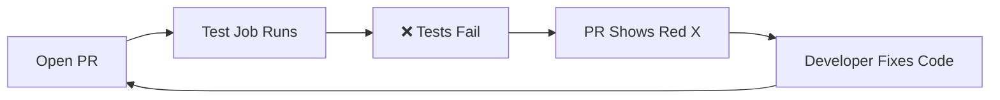
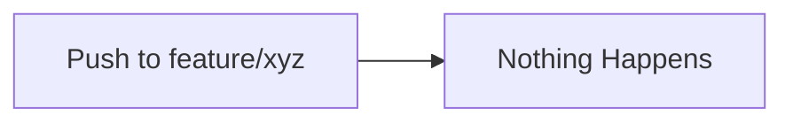

# Hello World FastAPI - CI/CD Demo

A self-contained demonstration of GitHub Actions CI/CD pipeline that builds, tests, and deploys a Docker container to GitHub Packages. **Everything runs inside containers - nothing is installed on the host.**

## 🎯 What This Project Demonstrates

This educational project shows:
- ✅ Containerized development (nothing installed on host)
- ✅ Docker Compose for local development
- ✅ Unit testing inside containers
- ✅ GitHub Actions CI/CD pipeline
- ✅ Automated container builds and publishing to GitHub Packages

---

## 📁 Project Structure

```
cicd-pipeline-demo/
├── docker-compose.yaml    # Container orchestration
├── Dockerfile             # Container definition
├── main.py                # FastAPI application
├── requirements.txt       # Python dependencies (pinned versions)
├── static/
│   └── index.html         # JavaScript frontend
├── tests/
│   └── test_main.py       # Unit tests
├── .github/
│   └── workflows/
│       └── docker-image.yml  # CI/CD pipeline
└── README.md
```

---

## 🚀 Quick Start (Using Docker Compose)

**Prerequisites:** Docker and Docker Compose installed on your machine.

### Run the Application

```bash
# Clone the repository
git clone https://github.com/NOAA-GSL/cicd-pipeline-demo.git
cd cicd-pipeline-demo

# Build and run the container
docker compose up --build

# Visit http://localhost:8112 in your browser
```

### Run Tests (Inside Container)

```bash
# Run tests using the testing profile
docker compose --profile testing run --rm test
```

### Stop the Application

```bash
docker compose down
```

---

## 🔄 CI/CD Pipeline Flowchart



---

## 🏗️ How the CI/CD Pipeline Works

### 1. **Test Job** (Runs on every push/PR)
```yaml
- Checkout code
- Run: docker compose --profile testing run --rm test
- Tests execute INSIDE a container (not on host)
```

### 2. **Lint Job** (Runs on every push/PR)
```yaml
- Checkout code
- Build container with ruff linter
- Check code style and potential bugs
```

### 3. **Build & Push Job** (Only on master branch, after tests AND lint pass)
```yaml
- Setup Docker Buildx (for efficient builds)
- Login to GitHub Container Registry (GHCR)
- Build Docker image with caching
- Push to ghcr.io/NOAA-GSL/cicd-pipeline-demo
- Verify container starts and responds to health check
```

---

## 🎓 CI/CD Best Practices Demonstrated

| Practice | How It's Implemented |
|----------|---------------------|
| **Container-First Development** | All code runs in containers, never on host |
| **Test in Production-Like Environment** | Tests run inside the same container used in production |
| **Code Quality Gates** | Linting with ruff catches bugs before they reach production |
| **Immutable Infrastructure** | Each build creates a new, versioned container image |
| **Automated Testing** | Tests run automatically before any build |
| **Image Versioning** | Images tagged with SHA, branch, and semantic versions |
| **Health Checks** | Container includes health endpoint for orchestration |
| **Pinned Dependencies** | requirements.txt uses exact versions |
| **Build Caching** | GitHub Actions cache speeds up builds |
| **Job Dependencies** | Build only runs after test AND lint pass |

---

## 📋 API Endpoints

| Endpoint | Method | Description |
|----------|--------|-------------|
| `/` | GET | Serves the HTML/JS frontend |
| `/health` | GET | Health check for container orchestration |
| `/comments` | GET | Get all comments |
| `/comments` | POST | Create a new comment |

---

## 🧪 Running Tests

Tests always run inside a container to ensure consistency:

```bash
# Run unit tests (recommended)
docker compose --profile testing run --rm test

# Run linting/code quality checks
docker compose --profile testing run --rm lint

# Run both tests and lint
docker compose --profile testing run --rm test && docker compose --profile testing run --rm lint
```

**Never run tests directly on the host** - this defeats the purpose of containerization.

---

## 📦 GitHub Packages

After a successful build on the `master` branch, the container image is published to:

```
ghcr.io/NOAA-GSL/cicd-pipeline-demo:latest
ghcr.io/NOAA-GSL/cicd-pipeline-demo:master
ghcr.io/NOAA-GSL/cicd-pipeline-demo:sha-<full-commit-sha>
```

### Pull and Run the Published Image

```bash
docker pull ghcr.io/NOAA-GSL/cicd-pipeline-demo:latest
docker run -p 8112:8112 ghcr.io/NOAA-GSL/cicd-pipeline-demo:latest
```

---

## 🔧 Local Development

### Rebuild After Code Changes

```bash
docker compose up --build
```

### View Logs

```bash
docker compose logs -f
```

### Shell into Container

```bash
docker compose exec web /bin/bash
```

---

## ⚠️ Important Notes

- **No Python installed on host required** - Everything runs in Docker
- **No pip install on host** - Dependencies are installed inside the container
- **No uvicorn on host** - The application server runs inside the container
- **Data is not persisted** - Comments are stored in memory (intentional for simplicity)

---

## 🎬 What Happens When... (Scenarios)

Understanding CI/CD means knowing what happens in different situations:

### Scenario 1: Developer pushes directly to `master`

**Result:** If tests pass, new image is built and pushed.

### Scenario 2: Developer opens a Pull Request

**Result:** Tests run, but NO image is built. Build only happens after merge.

### Scenario 3: Tests fail on PR

**Result:** PR cannot be merged until tests pass.

### Scenario 4: Developer pushes to a feature branch

**Result:** Workflow only triggers on `master` branch and PRs to `master`.

---

## 🛡️ Recommended: Branch Protection Rules

For a complete CI/CD setup, enable branch protection in GitHub:

1. Go to **Settings → Branches → Add rule**
2. Set branch name pattern: `master`
3. Enable these options:
   - ✅ Require a pull request before merging
   - ✅ Require status checks to pass before merging
   - ✅ Require branches to be up to date before merging
   - ✅ Select required checks: `test`, `lint`

This prevents anyone from pushing broken code directly to `main`.

---

## ❌ Common Mistakes to Avoid

| Mistake | Why It's Bad | What to Do Instead |
|---------|--------------|-------------------|
| Running tests on host | "Works on my machine" syndrome | Always test in container |
| Skipping tests for "small changes" | Small bugs cause big problems | Never skip CI |
| Using `latest` tag in production | Can't reproduce or rollback | Use SHA or version tags |
| Hardcoding secrets in code | Security vulnerability | Use GitHub Secrets |
| Not using build cache | Slow builds waste time | Enable `cache-from/to` |
| Manual deployments | Human error, no audit trail | Automate everything |

---

## 🔍 How to View Workflow Runs

1. Go to your repository on GitHub
2. Click the **Actions** tab
3. See all workflow runs with status (✅ or ❌)
4. Click on a run to see detailed logs for each step

---

## 📚 Educational Resources

This project demonstrates patterns from:
- [Docker Best Practices](https://docs.docker.com/develop/develop-images/dockerfile_best-practices/)
- [GitHub Actions Documentation](https://docs.github.com/en/actions)
- [GitHub Packages](https://docs.github.com/en/packages)
- [FastAPI Documentation](https://fastapi.tiangolo.com/)

---

## 🏛️ Organization

This project is maintained by [NOAA Global Systems Laboratory](https://github.com/NOAA-GSL) as an educational resource for CI/CD practices.
